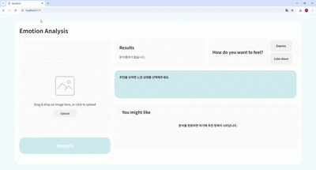

# 얼굴 기반 감정・성별・나이 분석 및 감정 완화 추천 시스템

---

## 📌 프로젝트 개요

본 프로젝트는 이미지 속 얼굴을 인식하여 감정, 나이, 성별을 **딥러닝 모델**로 예측하고,  
해당 결과를 바탕으로 사용자에게 **맞춤형 감정 완화 콘텐츠**를 추천하는 웹 서비스입니다.

React 기반 프론트엔드와 FastAPI 백엔드를 연동하여 **실시간 예측 및 추천 기능**을 구현하였습니다.

---
## 🖼️ UI 동작 예시

---

## 📁 데이터셋 정보

- 데이터는 얼굴 이미지, 감정 라벨, 나이 및 성별 정보로 구성되어 있으며,  
  전처리 과정을 거쳐 모델 학습에 활용하였습니다.
- 감정 데이터는 균형 있게 분포되어 있었지만, 나이/성별 간 불균형 문제가 존재하였습니다.
- 예시

| 연령대/성별 | 이미지 수 |
|-------------|-----------|
| 20대 여     | 1727      |
| 20대 남     | 1347      |
| 30대 남     | 995       |
| 30대 여     | 985       |
| 40대 여     | 356       |
| 40대 남     | 341       |
| 50대 여     | 106       |
| 50대 남     | 58        |
| 10대 여     | 57        |
| 10대 남     | 17        |
| 60대 여     | 5         |

### 데이터셋 관련 안내
본 프로젝트에 사용된 데이터셋은 EST SOFT 측에서 제공받은 자료로,
외부 공개나 공유에 제한이 있을 수 있어 별도의 다운로드 링크를 제공하지 않습니다. 

---

## 📂 추가 데이터 및 Pretrained 모델

- **감정 예측**  
  - AffectNet 데이터셋 사용  
  - Hugging Face 경로: [AffectNet 링크](https://huggingface.co/datasets/chitradrishti/AffectNet)

- **나이/성별 예측**  
  - VGGFace2 기반 ResNet50 사전학습 모델 사용  
  - GitHub 경로: [VGGFace2 ResNet50](https://github.com/cydonia999/VGGFace2-pytorch)
  - agegnedernet에 쓰인 afad dataset
  - dataset 경로:  [afad](https://www.kaggle.com/datasets/lyk1652/afad-full)

---

## ✨ 주요 기능

- 📷 얼굴 이미지에서 감정, 성별, 나이 예측
- 💡 감정 상태에 맞는 맞춤형 감정 완화 콘텐츠 및 상품 추천 (네이버 검색 API 활용)
- 🔄 React 기반 프론트엔드 + FastAPI 백엔드 연동
- ⚙️ 실시간 예측 결과 제공 및 API 응답 처리

---

## 🛠️ 사용 기술 스택

| 분야       | 기술                                                                                                     |
|------------|----------------------------------------------------------------------------------------------------------|
| **Frontend** |  React &nbsp;&nbsp;  Axios &nbsp;&nbsp;  Vanilla CSS |
| **Backend**  |  Python &nbsp;&nbsp;  FastAPI &nbsp;&nbsp;  OpenAI API &nbsp;&nbsp; EmotionFAN (감정 예측) |
| **AI/ML**    |  PyTorch &nbsp;&nbsp;  TorchVision &nbsp;&nbsp;  ResNet50 &nbsp;&nbsp;  Pandas &nbsp;&nbsp; vit &nbsp;&nbsp; agegendernet |
| **기타**     |  NumPy &nbsp;&nbsp; Matplotlib &nbsp;&nbsp;  Pillow &nbsp;&nbsp;  JSON |

---

## 🚀 실행 방법
### 1. 프론트엔드 실행 
cd frontend
npm install
npm run dev

### 2. 백엔드 서버 실행
cd backend

#### 가상환경 생성 (원하는 이름으로)
python -m venv <env_name>

#### 가상환경 활성화
#### Windows (PowerShell) 버전
<env_name>\Scripts\Activate.ps1

#### Windows (cmd) 버전
<env_name>\Scripts\activate.bat

#### macOS / Linux 버전
source <env_name>/bin/activate

#### 필요한 패키지 설치 
pip install fastapi uvicorn torch torchvision torchmetrics pandas numpy pillow matplotlib

#### FastAPI 서버 실행
uvicorn main:app --readload

---
## 📊 모델 성능 요약
예측 항목    : 감정 예측
모델 구성    : EmotionFAN + AffectNet
성능 지표    : 정확도 86%

예측 항목    : 나이 예측
모델 구성    : ResNet50 + EstSoft data
성능 지표    : MAE 약 5

예측 항목    : 성별 예측
모델 구성    : ResNet50 + EstSoft data
성능 지표    : 정확도 94%

---
## 💡 회고 및 추후 방향

- 데이터 불균형 문제 해결을 위해 가중치 조정 및 샘플링 기법 적용
- 나이/성별 예측에 멀티태스크 학습 방식 도입
- 프론트엔드와 백엔드 API 연동 완료 및 실시간 예측 결과 UI 반영

앞으로의 개선 방향:
- 후반부 레이어 미세조정 실험
- 오토인코더 기반 감정 표현 강화 실험
- 사용자 피드백 반영 UI/UX 고도화 및 기능 개선

---
## 팀원
김수민 김은서 박용학 송창기(팀장)

